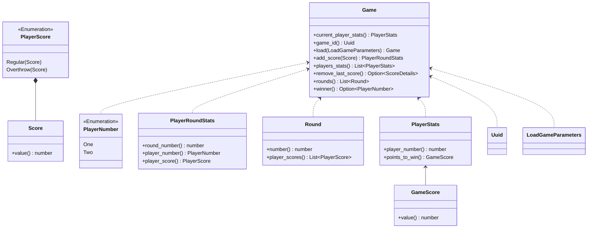

# Class diagram

```mermaid
classDiagram
    class Score {
        +value() number
    }

    class PlayerScore {
        <<Enumeration>>

        Regular(Score)
        Overthrow(Score)
    }

    class PlayerNumber {
        <<Enumeration>>

        One
        Two
    }

    class GameScore {
        +value() number
    }

    class PlayerRoundStats {
        +round_number() number
        +player_number() PlayerNumber
        +player_score() PlayerScore
    }

    class Round {
        +number() number
        +player_scores() List~PlayerScore~
    }

    class Game {
        +current_player_stats() PlayerStats
        +game_id() Uuid
        +load(LoadGameParameters) Game
        +add_score(Score) PlayerRoundStats
        +players_stats() List~PlayerStats~
        +remove_last_score() Option~ScoreDetails~
        +rounds() List~Round~
        +winner() Option~PlayerNumber~
    }

    class PlayerStats {
       +player_number() number
       +points_to_win() GameScore
    }

    PlayerScore *-- Score
    PlayerStats <-- GameScore
    Game <.. PlayerStats
    Game <.. Uuid
    Game <.. LoadGameParameters
    Game <.. PlayerRoundStats
    Game <.. Round
    Game <.. PlayerNumber
```
