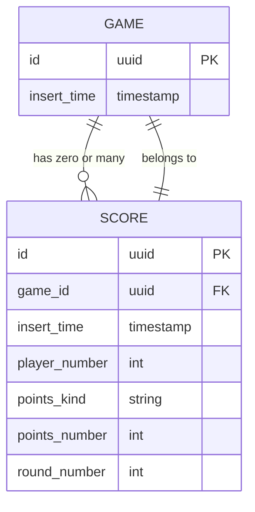

# Entity relationship diagram

```mermaid
erDiagram

    GAME {
        id uuid PK
        insert_time timestamp
    }

    SCORE {
        id uuid PK
        game_id uuid FK
        insert_time timestamp
        player_number int
        points_kind string
        points_number int
        round_number int
    }

    SCORE ||--|| GAME : "belongs to"
    GAME ||--o{ SCORE : "has zero or many"
```
